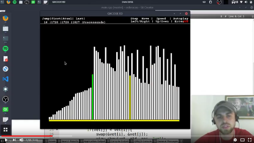

# Módulo de ordenação

## Assista o vídeo.

## Atividades do módulo.

1. Implementar um embaralhador de vetor.
2. Criar um vetor crescente e embaralhe.
3. Implementar o minimum de forma que em cada laco ele encontre o mínimo e o máximo.
4. Implementar o bubble sort
5. Implementar o selection sort.
5. Implementar o quick sort
6. Implementar o merge sort
7. Implementar o bucket sort
